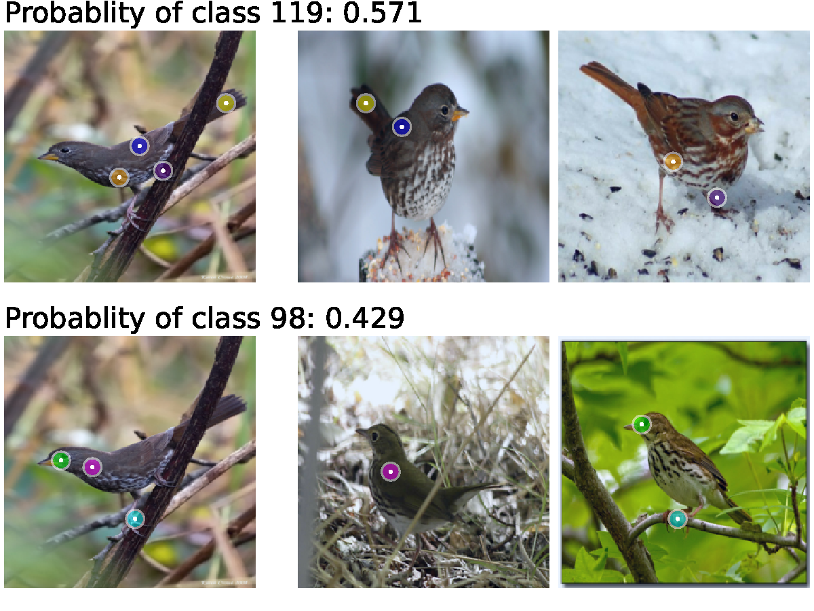
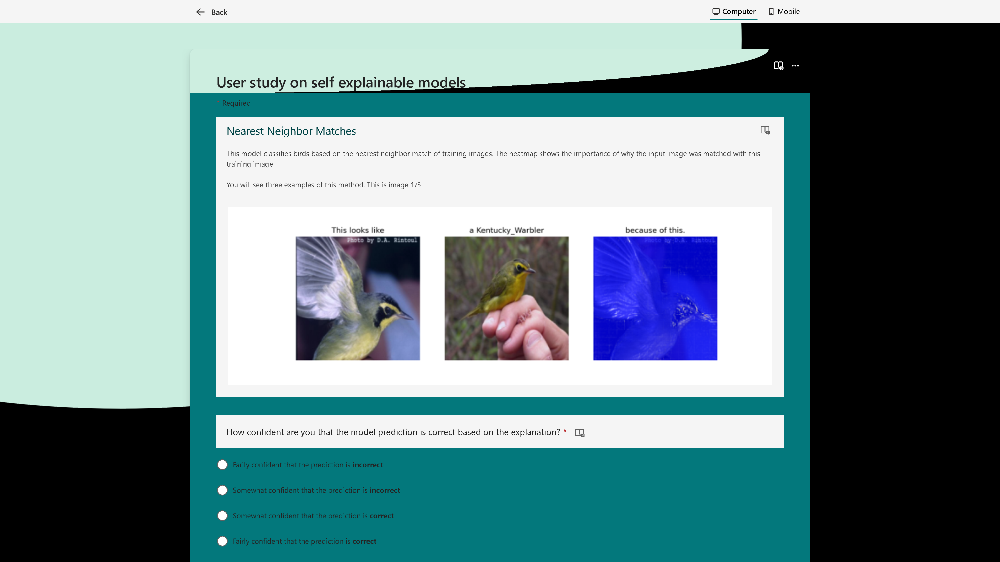

# Keypoint Counting Classifiers (KCC)

Official repository for **Keypoint Counting Classifiers (KCCs)** — a framework that transforms any ViT-based foundation model into a self-explainable model (SEM) without requiring retraining of the feature extractor or an additional classification head.

**Paper:** Wickstrøm, K., et al. *Keypoint Counting Classifiers*. arXiv:2512.17891, 2024.
https://arxiv.org/abs/2512.17891

---

## Introduction

Vision Transformer (ViT)-based foundation models are becoming increasingly important in computer vision, but remain limited in safety-critical domains due to their lack of explainability. Self-explainable models (SEMs) provide a promising direction within explainable artificial intelligence (XAI), where the decision process is inherently transparent — which is critical for addressing the *disagreement problem* that standard post-hoc explainability methods suffer from. However, existing SEMs have two key limitations:

**(1) SEMs lack flexibility.** ViT-based foundation models are highly flexible and can often be applied to new tasks without finetuning. In contrast, SEMs regularly assume a particular architecture (e.g. CNN-based feature extractors), making them incompatible with ViT foundation models. SEMs that do support ViTs typically require training an additional classification head, reducing overall flexibility.

**(2) Current SEMs visualize explanations poorly.** Explanations in existing SEMs are presented as bounding boxes or heatmaps. Bounding boxes have been shown to be misleading — covering more area than the actual activation site. Heatmaps have been criticized for lacking precision, being uninformative, and performing poorly in user studies.

KCCs address both limitations. They compare *parts* of a query image with *parts* of prototypes by leveraging part-correspondence in ViT tokens, identify matching regions using mutual nearest neighbors, and classify by counting matches — with no retraining required. Explanations are visualized as matching keypoints, introducing a novel and cognitively lightweight communication method.

The use of keypoints is motivated by their widespread use in teaching material: in ornithology (bird topography), human anatomy, and cognitive load research, which shows that people can only process a limited number of pieces of information at a time. When ViTs with vision-language capabilities are used, keypoints can also be automatically labeled, reducing reader bias.

### Contributions

1. We introduce Keypoint Counting Classifiers — a general-purpose method for turning ViT-based foundation models into SEMs without any retraining.
2. We conduct an extensive quantitative evaluation with comparison to recent and relevant baselines that demonstrates the benefits of KCCs.
3. We conduct a human user study showing that KCCs improve human-machine communication compared to existing alternatives.
4. We show how ViTs with vision-language capabilities can automatically label keypoints, making initial progress towards reducing reader bias.

---

## Example

Below is a KCC explanation for a bird classification query. KCCs identify matching keypoints between the query image (leftmost) and a set of prototypes. Only prototypes with matches are shown. Predictions are made by counting the number of matches. Class names are deliberately omitted to encourage using the visual explanation rather than the label.

---

## User Study

We conducted a user study to evaluate how different SEM explanation types are perceived by humans, following the HIVE framework for falsifiable hypothesis testing, cross-method comparison, and human-centered evaluation. The study compared three visualization methods — **bounding boxes**, **heatmaps**, and **keypoints** — using two baselines:

- **PiP-Net** — prototype-based explanations with bounding boxes
- **KMEx** — example-based explanations with heatmaps

Each participant viewed three randomly selected examples per method (drawn from six correct and six incorrect classifications per method), with class labels omitted to avoid bias. We evaluated *agreement* with the model prediction, *quality* of the explanation, and *understanding* of the explanation.

**KCC (keypoints)**

**KMEx (heatmaps)**

**PiP-Net (bounding boxes)**

---

## Getting Started

The notebook walks through the full KCC pipeline using example bird images and DINOv2 feature extraction.

